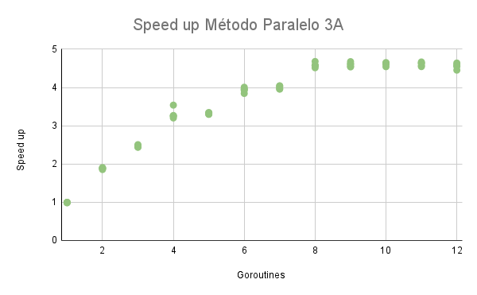

# T1-Paralela

### Objetivo: Criar um algoritmo sequencial e paralelo. Além disso criar uma biblioteca própria de paralelismo e testa-la junto com as anteriores

## Contribuidores
* Felipe Delduqui
* Sandro Santana Ribeiro

## Soluções

### Solução Sequencial

Cada vetor é ordenado individualmente, um de cada vez, utilizando o algoritmo MergeSort.

Serve como base de comparação para as versões paralelas.

### Solução Paralela 2A (Entre tarefas)

O programa executa várias tarefas independentes em paralelo, onde cada tarefa é a ordenação de um vetor.

As tarefas são distribuídas a um pool de threads (workers) equivalente ao número de núcleos da CPU.

Cada tarefa usa o MergeSort sequencial internamente, garantindo isonomia no teste de paralelismo entre tarefas.

### Solução Paralela 2B (Dentro da tarefa)

Dentro de cada tarefa, usou-se um MergeSort paralelo

Essa versão cria goroutines recursivamente até um limite controlado de profundidade e tamanho mínimo de partição, evitando overhead excessivo.

Implementada em cmd/parallel/parallelMergeSort.go.

### Solução Biblioteca 3A (Entre tarefas, MergeSort Sequencial)

Foi desenvolvida uma biblioteca genérica de execução paralela, localizada em cmd/lib/executor.go.

A biblioteca implementa um pool de threads baseado no padrão Produtor/Consumidor.
Cada vetor é tratado como uma tarefa independente, processada em paralelo pelos workers.
Dentro de cada tarefa, o algoritmo utilizado é o MergeSort sequencial (seq.MergeSort).

### Solução Biblioteca 3B (Entre tarefas, MergeSort Paralelo)

Utiliza a mesma biblioteca da solução 3A (cmd/lib/executor.go), mas substitui o algoritmo interno de cada tarefa.

Cada tarefa executa o MergeSort paralelo (parallel.ParallelMergeSort), que divide o vetor em subtarefas internas.
Dessa forma, o paralelismo ocorre tanto entre tarefas (via executor) quanto dentro de cada tarefa (via goroutines do algoritmo).

## Padrões de Projeto Aplicados

* Worker Pool / Produtor–Consumidor – gerenciamento das tarefas paralelas.

* Fork–Join – usado no MergeSort paralelo.

* Divide and Conquer – estrutura de recursão e fusão do MergeSort.

* Strategy – escolha entre diferentes modos de execução (sequencial, paralelo 1, paralelo 2).

## Speed up

### Comparando com solução Paralela 2A


Speed up cresce até ~4,5× e estabiliza. Ganho limitado por overhead de criação de goroutines e balanceamento de carga.

### Comparando com solução Paralela 2B


Speed up chega a ~5–6×, indicando melhor aproveitamento do paralelismo interno do algoritmo, mas com saturação após 8–10 goroutines.

### Comparando com solução Paralela 3A



Comportamento quase idêntico ao 2A, mostrando que a biblioteca replica corretamente a execução paralela entre tarefas.

### Comparando com solução Paralela 2B


Apresenta desempenho próximo do 2B, confirmando que o executor mantém eficiência mesmo com paralelismo interno no MergeSort.

## Compilação
Para compilação, utilize os seguintes códigos no terminal:

```bash
$ go build main.go
$ ./main
```

## Estrutura de pastas
As pastas foram estruturadas da seguinte maneira:
```text
paralela/
│
├── cmd/
│   ├── lib/
│   │   └── executor.go            # Biblioteca de execução paralela
│   ├── parallel/
│   │   └── parallelMergeSort.go   # MergeSort paralelo com limitação de profundidade
│   ├── seq/
│   │   └── sequentialMergeSort.go # MergeSort sequencial
│   └── util/
│       └── arrayGeneration.go     # Geração determinística de vetores
│
├── img/
│
├── main.go                        # Execução e comparação das versões
└── go.mod                         # Configuração do módulo Go

```
